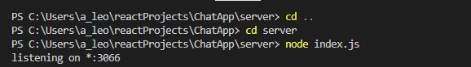
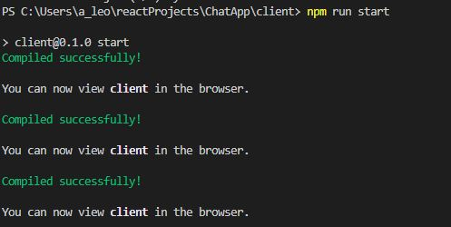
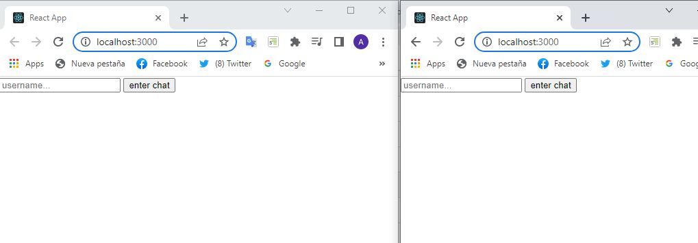
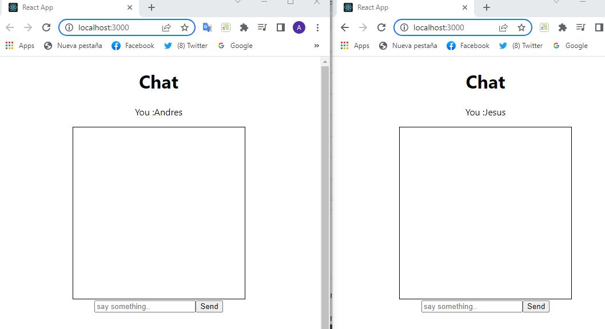
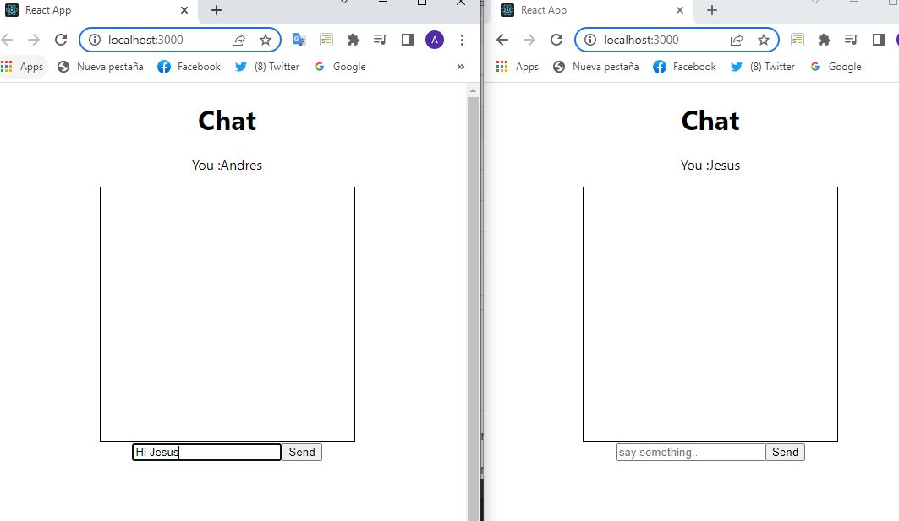
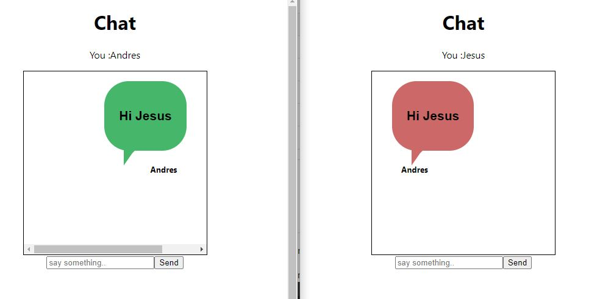
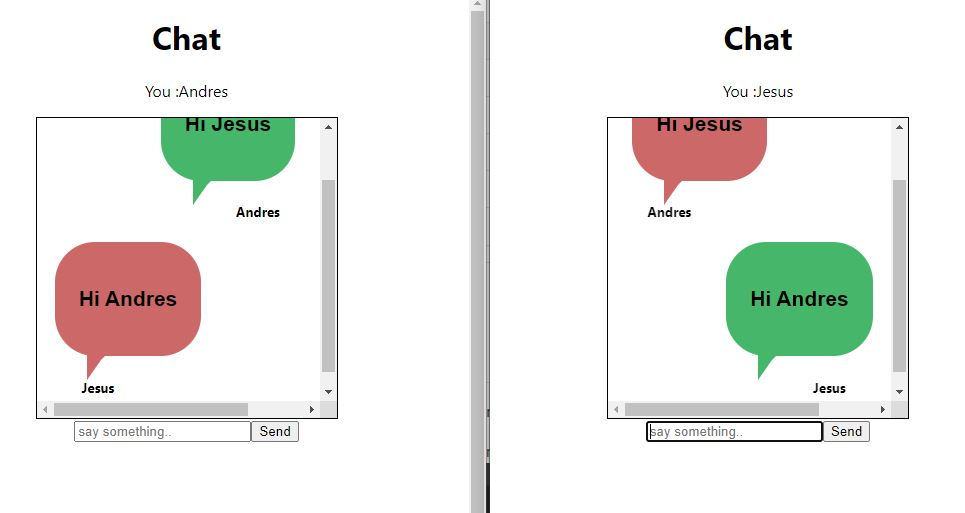

# SocketAppChat
ChatApp using Socket.io
In order to make this project run you need to follow some steps.
1. you should open two terminals , one to run the socket server and one to run the react . 
2.to run the backend you should type  node index.js  in one of the terminal ( inside the server folder). 
  
3.to run the front ent you should type npm run start  in one of the terminal ( inside the client folder).
  
4.Open another local host and type the username you want to use   .
 
5.you can see how Andres is sending messages to Jesus and also from Jesus to Andres. 
 
 
 
 
